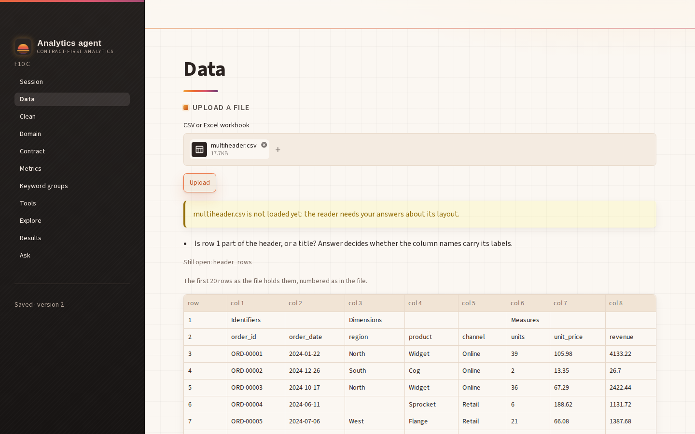
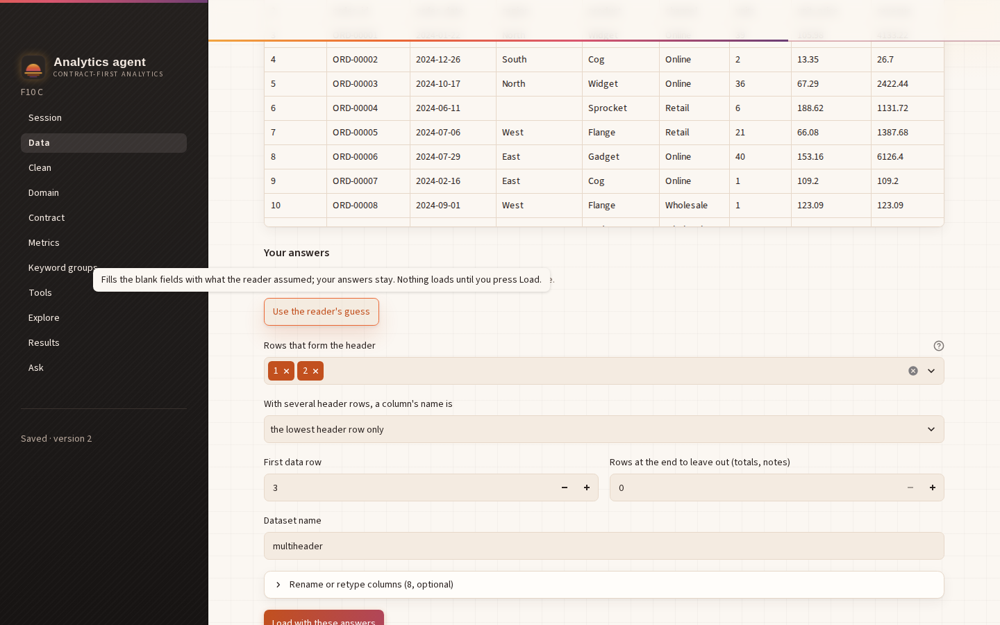
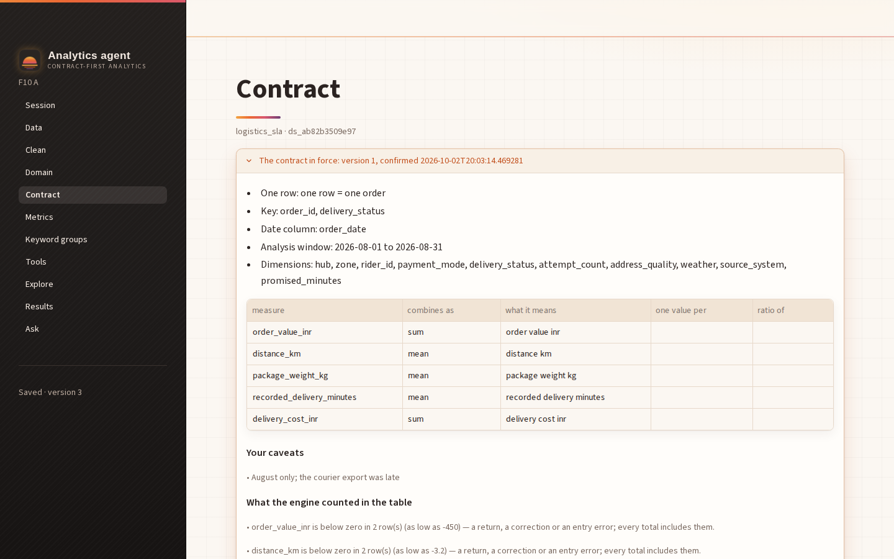
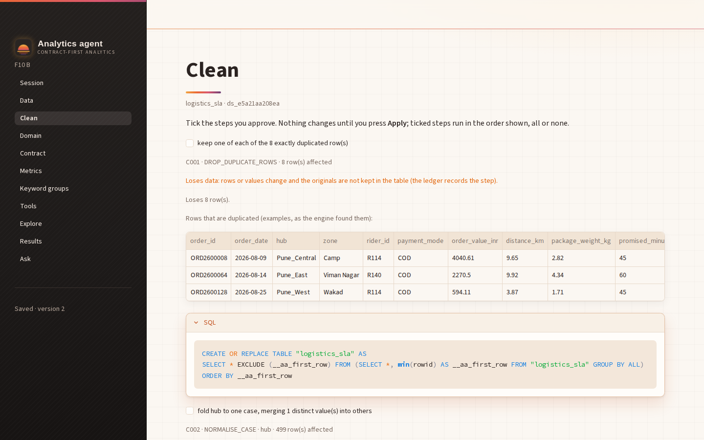
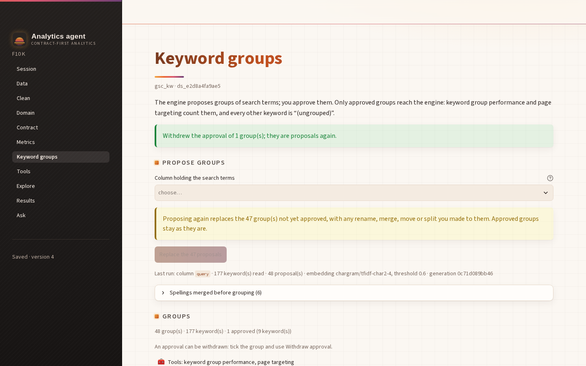
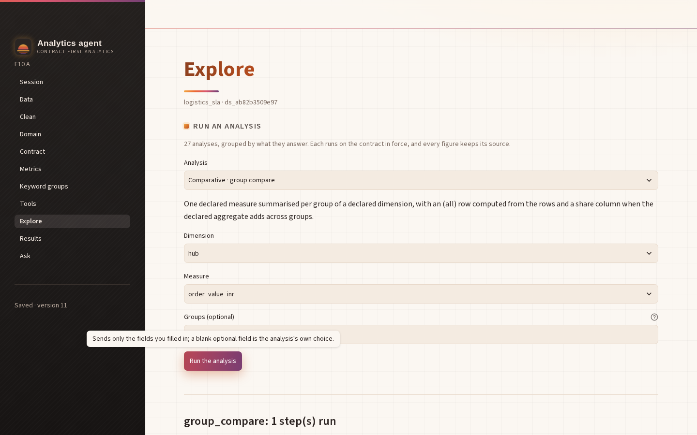
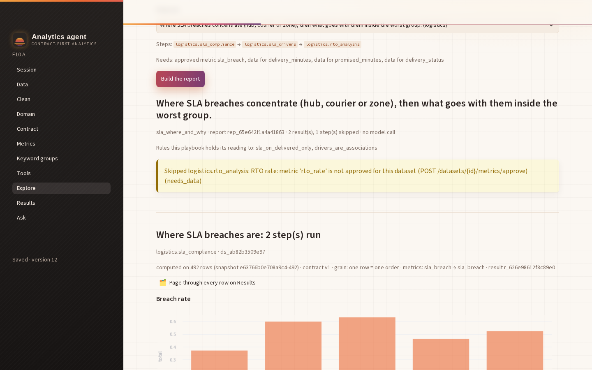

# F10 — The last gaps: upload answers, contract in force, cleaning losses, withdraw, optional params, Explore and reports

Date: 2026-10-02. Branch: **main**. API **0.9.0**: B10 answered #16, #17, #20, #21 and #23
(0.8.0); B11 answered #22 (0.9.0). Owner: Claude Code. The user: "complete all remaining task in
the frontend".

## What the real backend does (probed before design)

Probed in-process (`make_env`) with the backend's fixtures:

- **#16, upload answers.**
  - `multiheader.csv` → 422 `ingest_needs_answers` with:
    - `upload_id`;
    - `unresolved` ["header_rows"];
    - `questions` ["Is row 1 part of the header, or a title? …"];
    - `preview` {sheet null, sheet_names [], first_row_number 1, rows (20, as in the file:
      row 1 `["Identifiers", null, "Dimensions", …]`, row 2 the names), guess {header_rows
      [1, 2], header_join bottom_only, data_start_row 3, footer_skip_rows 0, name multiheader,
      columns [{source, target, type null}…]}}.
  - `POST /workspaces/{ws}/uploads/{upload_id}/answers {header_rows, header_join, …}` → 201
    `Dataset` (300 rows, 8 columns, with assumptions).
- **#17, contract in force.** `GET /datasets/{id}/contract`:
  - {version, confirmed_at, grain, primary_key, date_column, dimensions, the analysis window};
  - measures [{column, agg, definition, per, ratio}];
  - `caveats` (declared) and `measured_caveats` (the engine's), kept apart;
  - fork_choices, metrics {template: measure}, validity_rules.

  Before a confirm it answers 409 `contract_required`.
- **#21, cleaning losses.** Proposals carry `values_lost` + `loss_unit` ("row", "distinct
  value", "value"), `samples` and `sql` (`CREATE OR REPLACE TABLE …`):
  - a duplicated row is `{row: {...}, copies: 2}`;
  - a changed value is `{value}`, e.g. PUNE_WEST / Pune_West for a case fold.
- **#20, withdraw.** The `unapprove` action returns the group to proposal.
- **#23, optional params.** Each tool spec has `params_optional` [{name, kind, help, default}]:
  - `sla_drivers.focus`: text, default null;
  - `stuck_shipments.days`: number, default "3".
- **#22, analyses.** `GET /datasets/{id}/analyses` gives 27 analyses {name, tier 1–7, summary,
  fields[{name, kind, required, choices}]}.
  - Field kinds: measure, dimension, column and grain come with the contract's choices; date,
    integer, number, period, list and text don't.
  - `POST /tools/core.group_compare/run` → a stored result (35 figures, 1 series).
  - Missing `measure` → 422 `param_required` {missing}; an unknown param → 422
    `unknown_params` {unknown, fields}.
- **#22, reports.**
  - Playbooks come from `GET /packs/{id}` → `pack.playbooks` [{id, description, slots,
    steps, requires_metrics, requires_concepts, recovery}].
  - `POST /datasets/{id}/reports {playbook}` → {playbook, run_id rep_…, description, rules,
    skipped, results}: two results, one skipped step with its reason.
  - Blocked → 422 `playbook_blocked` {missing, recovery}; another pack's playbook → 404.

## Scope

1. **Data: answer a refused upload.**
   - Show the reader's questions and the first 20 rows, with row numbers.
   - The form, blank: sheet (when several), header rows, how stacked headers join, the first
     data row, footer rows to skip, the dataset name, and per column a new name and a type.
   - "Use the reader's guess" fills the blank fields from `preview.guess`.
   - "Load with these answers" sends only what is filled. If the file is still ambiguous, the
     new questions show; once loaded, it joins the session.
2. **Contract: the contract in force.** Version and confirmation time; grain, key, date and
   window; each measure with how it adds up, its meaning and "one value per"; dimensions;
   declared and measured caveats apart; fork answers, metrics and rules. Shown above the form,
   or "No contract confirmed yet".
3. **Clean: what a step loses.**
   - "Loses N row(s)/value(s)".
   - The engine's samples: the duplicated rows with their copies, or the values that merge.
   - The exact SQL in an expander.
4. **Keyword groups: withdraw.** "Withdraw approval of the N ticked approved" sends `unapprove`.
   The "can't be withdrawn" note goes.
5. **Tools: declared optional params.** They are read from `params_optional`, with their help
   and what a blank means. The step scan (`prep.optional_params`) reads the declaration instead.
6. **Explore** (new page, after Tools).
   - Choose an analysis (no default); options are labelled by tier: Descriptive, Comparative,
     Temporal, Relational, Anomaly, Inferential, Cohort.
   - Its summary, then every field, blank, with the contract's choices where they exist; dates
     as dates, numbers as numbers, a list as comma-separated values.
   - Run gives the result through the shared results view (lineage, rows on Results, CSV). The
     `param_required` / `unknown_params` replies name the fields.
   - The chosen analysis and its answers are saved.
7. **Reports** (on Explore).
   - Choose a playbook of a confirmed domain (no default) and see its description and what it
     needs; fill its slots if it has any.
   - "Build the report" runs it with no model call and shows every result, the skipped steps
     with their reasons, and the pack rules.
   - Blocked shows what's missing and the recovery.

## Expected results, stated before running

- AppTests (fake shaped as probed):
  - A refused upload shows its question and preview, with the form blank. "Use the reader's
    guess" fills it. Load sends exactly the filled answers and the dataset joins the session.
  - The contract in force shows its version and both caveat lists; before a confirm, the
    "none yet" note.
  - A lossy step shows "Loses 8 row(s)", its samples and its SQL.
  - Withdraw sends `unapprove [ids]`.
  - `focus` comes from `params_optional`, with its help.
  - Explore lists 27 analyses with none chosen. A run sends exactly the filled fields, typed,
    and shows the result. `param_required` names the field.
  - A report shows its results and skipped steps; a blocked one shows its recovery.
- Browser (real backend): every new screen once, each compared with the API. The upload answer
  loads multiheader.csv with the reader's guess. An Explore run equals the same run through
  the API. A report lists the same tools as the API.

## What was built

- **Data** (`views/data.py`, `prep.guess_answers` / `prep.upload_answers`).
  - A refused upload keeps its reply (`work["results"]["refused"]`). The page shows:
    - the reader's questions and what is still open;
    - the first rows, numbered as in the file;
    - the form.
  - The form's widgets are keyed by `upload_id`, so a re-asked upload (the same id, as probed)
    keeps what was typed.
  - "Use the reader's guess" fills only blank fields.
  - "Load with these answers" sends the filled ones. On success the dataset joins the session
    like any upload and the form goes; if refused again, the page says what was sent and shows
    the new questions.
  - The answers are not saved with the session: they belong to an upload, not a dataset
    (D-F10-2).
- **Contract** (`_in_force`). The contract in force sits in an expander above the form,
  labelled with its version and confirmation time. It shows:
  - one row, the key, the date column, the window and the dimensions;
  - a measures table: how each combines, what it means, one value per, ratio of;
  - "Your caveats" and "What the engine counted in the table", apart;
  - the fork answers, the approved metrics and the validity rules.

  Its cache (`contract`) drops on confirm, metric and rule approval, and answered forks.
- **Clean** (`_losses`): "Loses N <unit>(s).", duplicated rows as a table with their copies,
  changed values inline, the SQL in an expander.
- **Keyword groups**: "Withdraw approval of the N ticked" (approved ticks only) sends `unapprove`.
- **Tools**: optional params come from `params_optional`, with the pack's help plus what a blank
  means ("Blank: the tool uses 3."). Each declared kind gets its widget:
  - numbers: whole unless the default is fractional (D-F10-3);
  - dates: as YYYY-MM-DD;
  - columns: from the profile;
  - text and lists: as typed.

  `prep.coerce` turns a date widget's value into text.
- **Explore** (`views/explore.py`, new page after Tools; `state.PAGES`, `app.TITLES`,
  `shell.STEPS`).
  - Analyses: listed in tier order, labelled "Tier · name". Each field is shown by its kind:
    - the contract's choices for measure, dimension, column and grain;
    - a date input for dates;
    - whole numbers for integer fields, decimals for number fields;
    - text for period, list and text fields, each with the engine's format.

    None is filled. Runs go to `core.<name>` and show through `render_result`.
  - Reports: playbooks of the confirmed domains, read from each pack.
    - Each shows its steps, what it needs and its slots.
    - "Build the report" shows the description, the report id, the pack rules, each skipped
      step with its reason, and every result.
    - Blocked shows what's missing and the recovery.
  - Saved per dataset: `drafts[ds].explore = {analysis, fields{analysis: {field: value}},
    playbook, slots{playbook: {slot: value}}}` (allowlisted in `state._explore`).
- **Fake backend.** Every new route, shaped as probed: refusal and answers, contract in force,
  analyses (the real catalogue's 27), core runs with `param_required` / `unknown_params`,
  reports with blocked / skipped. It also carries cleaning samples and SQL, `unapprove`, a 422
  for an unknown keyword column, and the packs' declared optional params.

## Corrections to the expectations above

- "A lossy step shows 'Loses 8 row(s)'". 8 is the real fixture's count (the browser check
  shows it). The fake's duplicate step removes 1 row, so its test reads "Loses 1 row(s)."
- I stated 16 new tests before the first run; the file holds 18 (I miscounted my own list).
- Two expectations were missing and were found while building:
  - The packs declare optional params of kinds date, column and list too (the probe saw only
    text and number). Each now has its widget.
  - The fake's tool route answered 404 for any `core.*` id before reaching the analysis branch.
    It was the fake's bug, caught by the first test run.

## Tests

```text
$ frontend/.venv/bin/python -m pytest frontend/tests -q -rs
289 passed in 29.73s        (271 + 18 in test_f10_api09.py; no skips)
```

- First run of the new file: 15 of 18 passed. The 3 failures were the fake's `core.*` 404
  (above).
- Two existing tests changed with the API:
  - `test_optional_params_are_the_ones_the_pack_declares` (the step scan is gone);
  - the F2 links test (Explore is in the sidebar).
- Before committing, a review of my own diff found two faults:
  - a declared date param would have sent a `date` object (not JSON);
  - an analysis field whose contract offers no choices fell back to free text.

  Both are fixed; a `coerce` check pins the first.

## Browser check (D-F2-1)

Setup:
- The real backend with a scripted model and an empty state dir; Streamlit; headless Chromium
  at 1440×900.
- Sessions made through the API:
  - **A**: the logistics fixture, cleaned and confirmed, contract with one declared caveat,
    `sla_breach` approved;
  - **B**: the same file uploaded only;
  - **K**: the keyword fixture, grouped, 2 groups approved;
  - **C**: empty.

Every value the page showed was compared with the API's own reply.

```text
1    refused: "multiheader.csv is not loaded yet: the reader needs your answers about its layout." · question "Is row 1 part of the header, or a title? Answer decides whether the column names carry its labels." · header-row chips before the guess: 0
1b   after the guess: header rows [] · first data row 3 · name "multiheader"
1c   loaded: "Loaded multiheader.csv with your answers." · session dataset ds_b89606629aa3 · page Rows/Columns 300/8 · API 300/8 · assumptions []
2    panel "The contract in force: version 1, confirmed 2026-10-02T20:03:14.469281" (equals API: version 1, 2026-10-02T20:03:14.469281) · declared "• August only; the courier export was late" · measured line shown: true · API measured 15
2b   metrics line "Approved metrics: sla_breach → sla_breach" · API {"sla_breach":"sla_breach"}
3    page ["Loses 8 row(s).","Loses 1 distinct value(s).","Loses 3 distinct value(s).","Loses 1 distinct value(s)."] · API ["Loses 8 row(s).","Loses 1 distinct value(s).","Loses 3 distinct value(s).","Loses 1 distinct value(s)."] · equal: true
3b   values line: "Values it changes (examples): PUNE_WEST, Pune_West"
3c   first SQL shown equals the API's: true ("CREATE OR REPLACE TABLE "logistics_sla" AS
SELECT * EXCLUDE (__aa_firs…")
4    "Withdrew the approval of 1 group(s); they are proposals again." · API: "katsu · info" approved=false · approved groups 2 → 1
5    "Days (optional)" blank: true · help "Open at least this many days before as_of. Blank: the tool uses 3." · pack declares [{"name":"days","kind":"number","help":"Open at least this many days before as_of","default":"3"}]
5b   ran: "Stuck shipments: 2 step(s) run" · "no as-of note"
6    27 analyses listed · ran "group_compare: 1 step(s) run" · page result r_c3127d1c70ba12b4: 40 figures · API run r_5e4d3905b899fd18: 40 figures · figures equal: true
6b   expander "Every figure (40), with its source"
7    "sla_where_and_why · report rep_65e642f1a4a41863 · 2 result(s), 1 step(s) skipped · no model call" · page tools ["logistics.sla_compliance","logistics.sla_drivers"] · API tools ["logistics.sla_compliance","logistics.sla_drivers"]
7b   page skipped ["Skipped logistics.rto_analysis: RTO rate: metric 'rto_rate' is not approved for this dataset (POST /datasets/{id}/metrics/approve) (needs_data)"] · API skipped ["logistics.rto_analysis"] · rules "Rules this playbook holds its reading to: sla_on_delivered_only, drivers_are_associations"
8    B (no contract/metric) via API: {"code":"not_found","message":"no playbook 'sla_where_and_why' for this data","milestone":null}
8b   B's Explore: "Analyses run under the dataset's contract: confirm it first." · "Reports come from the playbooks of a confirmed domain: confirm one on Domain."
```

Read with the screenshots:
- **1b's empty list was the script's selector, not the page.** The screenshot after "Use the
  reader's guess" shows chips 1 and 2, "the lowest header row only", first data row 3, footer
  0 and the name. The load in 1c went through, which needs `header_rows`: a load with only a
  name was refused, as probed.
- **5b found no note because the page shows it as a "•" caveat.** The stored result reads
  "Open 5+ days before 2026-08-31 (the as-of date you entered).", so `days=5` reached the
  engine.
- **Step 6 equality.** The page's result (its id read from the lineage line) and a separate
  API run of `core.group_compare` with the same fields have identical figures, all 40.
- **Script slips.**
  - The first run's tick of a keyword group used the checkbox role and Streamlit reverted it.
    Ticking the label, as the F6 script does, worked.
  - Steps 4–8 were then re-run on the same sessions (steps 1–3 had passed).

| | |
|---|---|
|  |  |
|  |  |
|  |  |



Servers stopped after the run.
