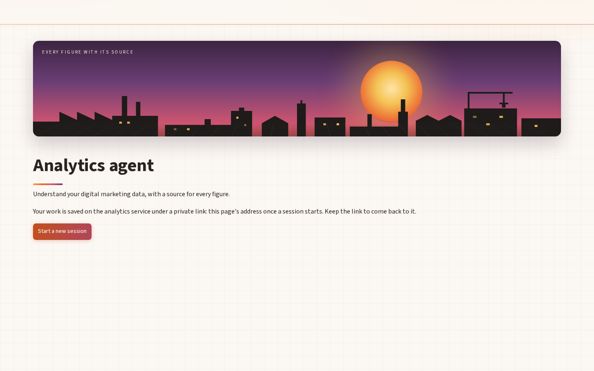
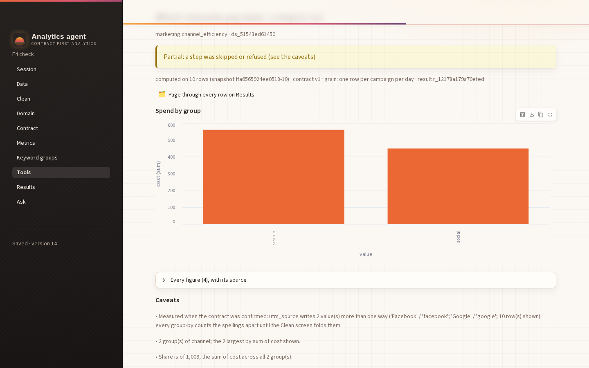
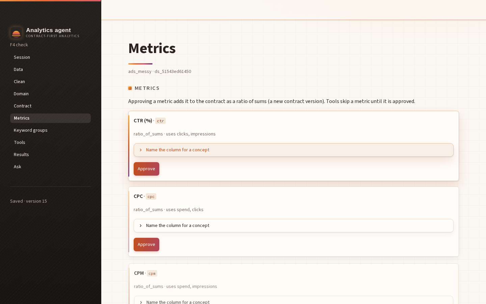
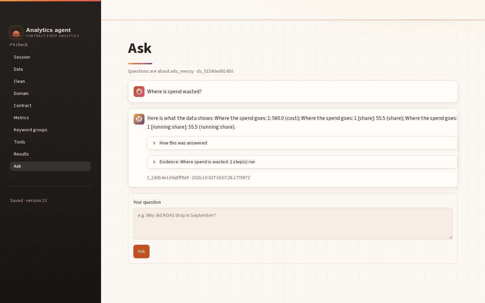
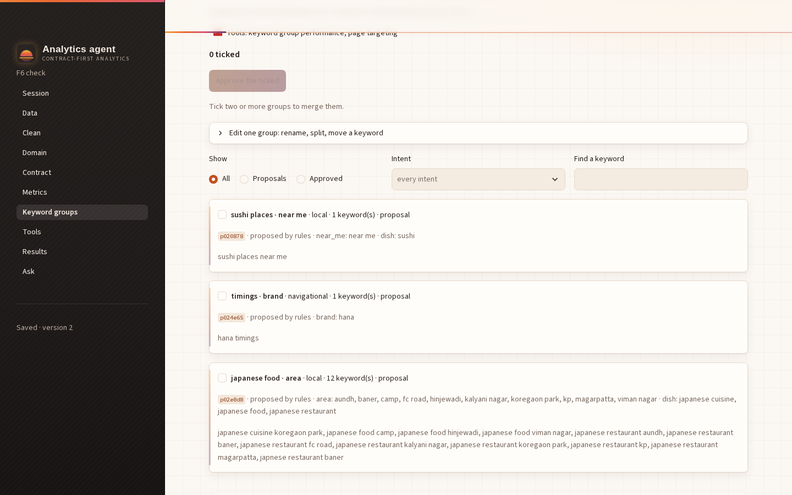
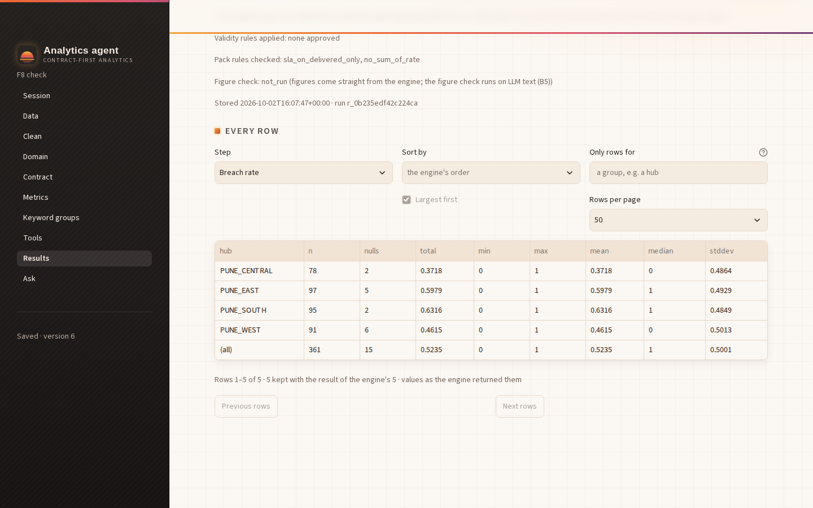

# F9 — The look: "sunset foundry" (warm sunset palette, industrial finish, motion)

Date: 2026-10-02. Branch: **main**. Owner: Claude Code. The user's brief: "warm sunset type
themed color, animation effects, scrolling effect etc. The style should reflect a professional
industrial type theme."



## The design

- **Surfaces.**
  - Warm paper (`#FBF7F2`) with a faint 32px drafting grid and a sunset glow at the top.
  - Graphite sidebar (`#1E1B1A`) with a brushed-metal texture and a slowly drifting sunset band
    across its top.
  - Cards in near-white with a warm shadow.
- **Accents.** Ember `#C2501E` → orange `#EB6834` → amber `#F2A541` → rose `#D9576F` → dusk
  `#6B3E75`, used as gradients:
  - the primary buttons;
  - the rule under each page title;
  - the header's scroll-progress line;
  - each card's left accent;
  - the brand mark.
- **Industrial finish.**
  - Section labels set like signage: uppercase, letter-spaced, with an amber marker.
  - Square-ish 0.45rem radii and visible widget borders.
  - A sun-over-horizon brand mark.
  - On the landing, a sunset over a factory skyline (stacks, sawtooth roofs, a gantry crane,
    lit windows) above a perspective grid floor.
- **Type.**
  - Inter for text, Barlow for headings (a signage face), JetBrains Mono for code, loaded from
    Google Fonts by the theme.
  - Where those can't load, the browser falls back to its sans-serif (the screenshots below show
    the fallback: this sandbox can't reach Google Fonts).

## Motion and scrolling

- The page content rises in on load. The title rule draws itself.
- Page titles carry a slow sunset glint.
- Primary buttons shift their gradient on hover, with a light sweep. Secondary buttons lift.
- Cards lift on hover and their accent lights up.
- Sidebar links slide in with an amber edge.
- On the landing:
  - the sun rises, then glows;
  - the sky drifts;
  - the windows twinkle.
- **Scroll-driven, CSS-only effects:**
  - a sunset progress line under the frosted header fills as you scroll;
  - cards, expanders, tables, charts, alerts and chat messages reveal (fade and rise) as they
    enter the view;
  - scrolling is smooth;
  - scrollbars are thin with a sunset thumb.
- **Safe by construction:**
  - Scroll effects sit inside `@supports (animation-timeline: view())`; elsewhere the page is
    the same, just still.
  - `prefers-reduced-motion: reduce` turns every animation and transition off.
  - No script runs in the page.
  - Nothing touches a figure.

## How it is built

- `frontend/.streamlit/config.toml` (Streamlit's script-level config for `frontend/app.py`).
  It holds the theme:
  - colours for the main area and the sidebar;
  - fonts and radii;
  - table header and borders;
  - the chart palette;
  - `client.toolbarMode = "minimal"`, which hides the Deploy button and developer menu.
- `frontend/components/style.py`:
  - `apply()` puts the stylesheet on every screen. It is style-only `st.html`, which Streamlit
    sends to its event container, so it takes no space.
  - `brand()` is the sidebar mark; `hero()` is the landing scene.
  - `card(key)` is a bordered container the stylesheet can find. Streamlit 1.64 marks a bordered
    block no differently from any other, but a keyed one carries `st-key-<key>`.
- Wired in:
  - `app.py` applies the style before any screen;
  - `shell.sidebar` shows the brand and `shell.landing` the hero;
  - the five bordered containers (contract measures and pre-fill, metric templates, keyword
    groups and joins) are `style.card(...)`.

### Chart colours (dataviz method)

Streamlit draws our charts with Vega-Lite; the theme's `chartCategoricalColors` sets their
colours. Every chart here is one series, so slot 1 colours them all. Three hand-picked sunset
palettes failed the validator: a teal read as gray, an amber was too light, and a red/green pair
collapsed for deuteranopia (ΔE 0.5). So the reference palette's steps were kept and only the order
changed:
- all 5,040 orders with orange in slot 1 were enumerated;
- 306 pass every gate;
- the best worst-pair CVD separation (15.3 deutan, 20.8 normal) ties across five orders;
- the one whose opening reads as a sunset was picked.

```text
$ node scripts/validate_palette.js "#eb6834,#4a3aa7,#e87ba4,#008300,#eda100,#e34948,#2a78d6,#1baf7a" --mode light --surface "#fbf7f2"
  [PASS] Lightness band         all 8 inside L 0.43–0.77
  [PASS] Chroma floor           all 8 >= 0.1
  [PASS] CVD separation         worst adjacent #e34948↔#eda100 ΔE 15.3 (deutan) · tritan 9.6
  [PASS] Normal-vision floor    worst adjacent #e34948↔#eda100 ΔE 20.8 (normal)
  [WARN] Contrast vs surface    below 3:1 — relief required (visible labels or table view): [["#e87ba4",2.52],["#eda100",2.03],["#1baf7a",2.64]]
  → ALL CHECKS PASS
```

Slot 1 (orange) is 3.0:1 on the paper. The three slots under 3:1 need a relief channel, and
every result has one: its "Every figure" table holds the same values.

### Text contrast (WCAG)

| Pair | Ratio |
|---|---|
| Ink on paper | 14.4 |
| Ink on card | 15.2 |
| Captions (`#7A6A61`) on paper | 4.85 |
| Section labels (steel) on paper | 6.93 |
| Links (ember) on paper | 5.30 |
| White on button gradient: ember / rose / dusk | 4.71 / 5.45 / 7.67 |
| Cream on graphite | 14.3 |
| Amber on graphite | 8.3 |
| Sidebar captions on graphite | 7.5 |

## Tests

```text
$ frontend/.venv/bin/python -m pytest frontend/tests -q -rs
263 passed in 27.58s        (259 + 4 in test_f9_style.py; no skips)
```

`test_f9_style.py` checks:
- the stylesheet reaches every screen exactly once (landing, invalid link, Session, Tools,
  Results, Ask);
- reduced motion turns everything off, scroll effects live only inside `@supports`, and there is
  no script or `javascript:` in any markup;
- the config holds the validated palette and every text pair above meets its ratio;
- the hero is on the landing and the brand is in the sidebar.

One test slip on the first run: a count of `animation-timeline` also matched the `@supports`
condition itself. The test now checks that no such declaration exists outside that block.

## Browser check (D-F2-1)

Setup: the real backend with a scripted model, Streamlit and headless Chromium at 1440×900.
Sessions set up through the API: the logistics fixture (results), the messy ads data (charts,
metrics, Ask) and the keyword fixture (48 proposals). Every screen was screenshotted and looked
at.

The review caught three things, and found two expectations wrong:
- **Captions were faint.** Streamlit dims caption containers to `opacity: .6`, which put
  `#7A6A61` at about 2.4:1. Opacity is now 1, giving 4.85:1 on paper and 7.5:1 in the sidebar.
- **Chat avatars were Streamlit's stock red.** They now carry sunset gradients.
- **Selectors written from memory were wrong for 1.64.**
  - There is no `stVerticalBlockBorderWrapper`; hence `style.card`.
  - The title's wrapper is `stHeadingWithActionElements`.
  - The current page's link has no `aria-current`, so Streamlit's own highlight is kept.
- The scroller was confirmed as `section.stMain`, which is what the timelines use.

Measured after the fixes:

```text
1 caption opacity/color: 1 rgb(122, 106, 97) · avatars: User: linear-gradient(135deg, rgb(194, 80, 30), rgb(217, 87, 111)) | Assistant: linear-gradient(135deg, rgb(242, 165, 65), rgb(107, 62, 117)
2 scroll reveal: {"cards":48,"before":"0","after":"1","running":58}
3 reduced motion: {"animations":0,"farCardOpacity":"1"}
3b reduced motion on landing: animations 0
header progress transform at 1800px: matrix(0.230858, 0, 0, 1, 0, 0)
```

- **Line 2.** A keyword card 200px below the fold starts at opacity 0 and is fully visible once
  scrolled into view.
- **Line 3.** With reduced motion, nothing animates and nothing is left hidden.
- **The last line.** At 1800px down the keywords page, the header's progress line is 23% across.

| | |
|---|---|
|  |  |
|  |  |



Servers stopped after the run.
